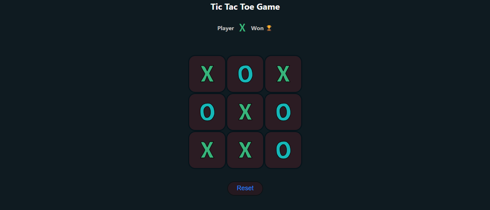

# Tic-Tac-Toe Game

A simple and interactive Tic-Tac-Toe game built with React. Players take turns marking cells with 'X' or 'O' to achieve three in a row, column, or diagonal. The game includes win detection, draw detection, and a reset feature.

## Features
- Alternating turns between 'X' and 'O'
- Win detection for rows, columns, and diagonals
- Draw detection when all cells are filled
- Reset button to start a new game
- Responsive design with clean UI

## Screenshot


## Getting Started

### Prerequisites
- Node.js and npm installed
- Git installed

### Installation
1. Clone the repository:
   ```bash
   git clone https://github.com/johnkoshy/TicTacToe-Application-React.git

2. Navigate to the project directory:
bash

cd TicTacToe-Application-React

3. Install dependencies:
bash

npm install

4. Start the development server:
bash

npm start

### How to Play

Click on any empty cell to place your 'X' or 'O'.
The game alternates between players automatically.
The game ends when a player wins or the board is full (draw).
Click the "Reset" button to start a new game.


### Technologies Used

React
CSS
JavaScript

### License
This project is licensed under the MIT License.